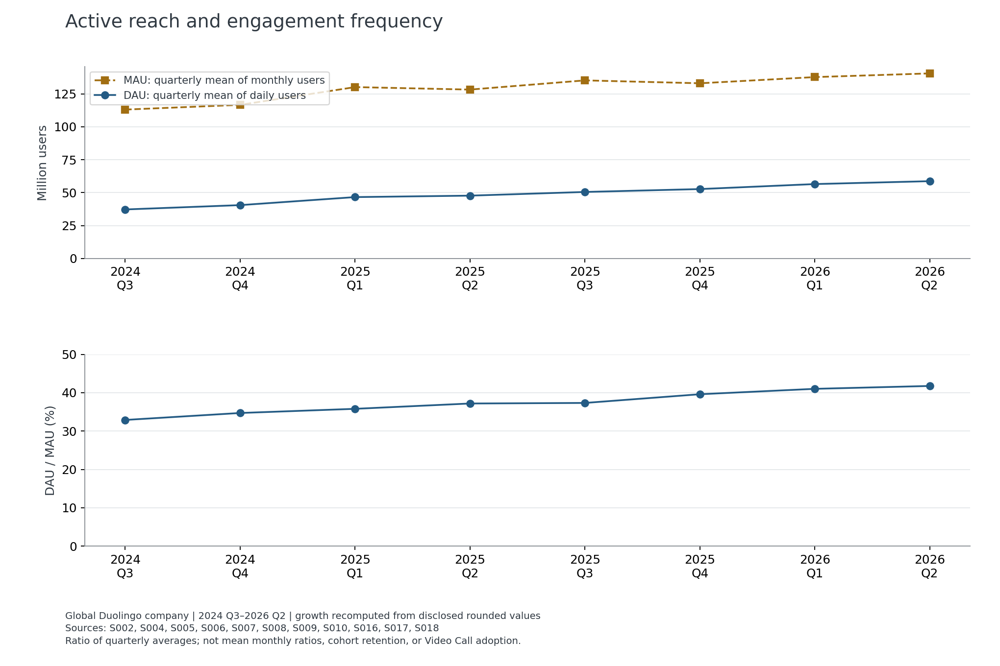
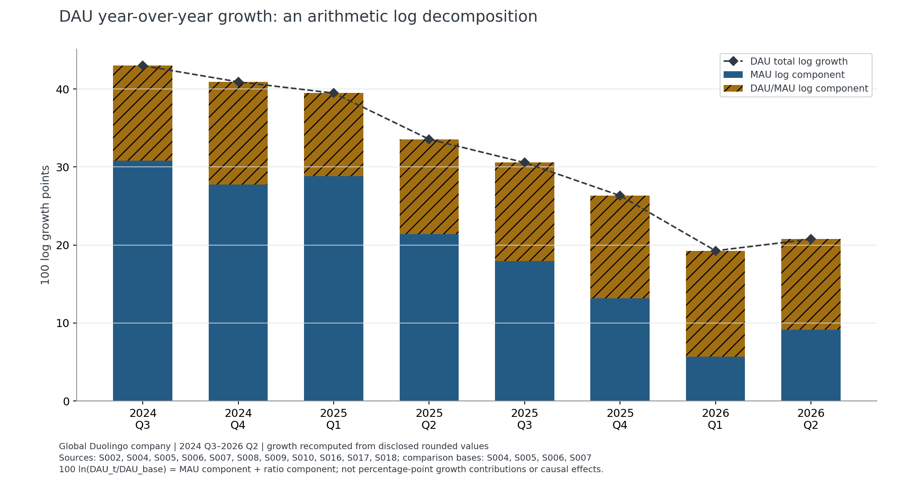
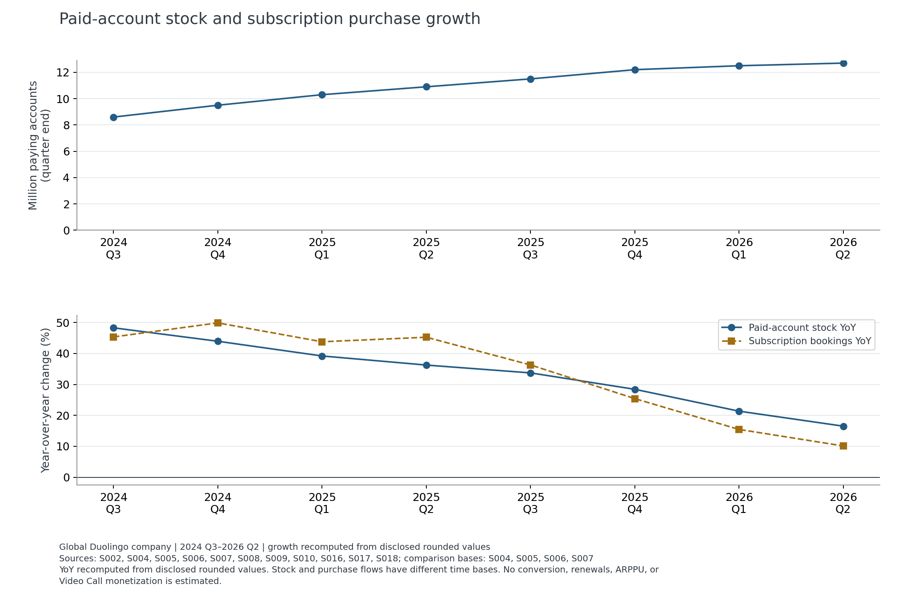
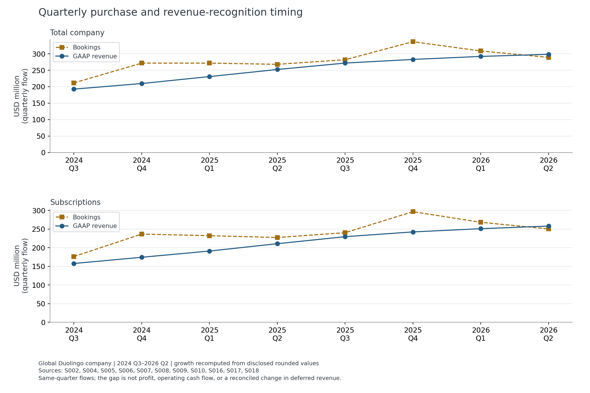
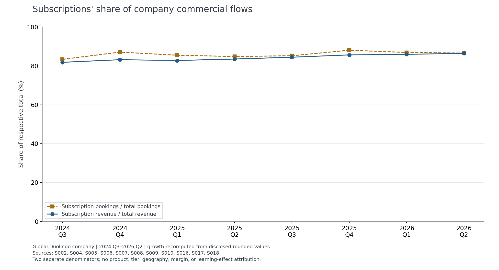

# Stage 3｜活跃结构改善，权益净价值仍需独立验证

数据窗口：2024 Q3–2026 Q2；财务与用户数据截至 2026-06-30，产品陈述单独保留披露日期（最晚 2026-08-05）；公司来源访问日：2026-09-30；v1.2收束复核：2026-10-02。当前状态：**降级通过**，用于公司经营诊断和条件性情景交接；具体通过与未达项见 [质量验收](data_quality_report.md)。

## 决策摘要

本阶段回答：公司公开经营发生了什么，这些变化如何约束 Speaking / Video Call 扩张的下一轮验证？这里的公司数据覆盖平台总体，不能分离 H1 日本语母语中级英语学习者、H2 美国英语界面初学西语用户，亦不能估算功能使用者的增量。

1. **参与结构改善，最近同比回升同时含当期变化和比较基数影响。**DAU/MAU 从窗口首季的 32.9% 增至末季 41.7%；2026 Q2 相比 Q1 的 DAU 同比回升，算术上对应 MAU 同比项增加，参与代理同比项收窄、仍为正。MAU同比项增加3.48对数增长点，由当期Q1→Q2增长2.01点与上年同期下降形成的基数项1.47点组成，不能全部解释为当期获客加速。经营活跃改善不能直接检验口语练习、学习迁移或留存效果。
2. **订阅购买需求与会计收入的增速分化。**2026 Q2 期末付费账户同比约 16.5%，订阅 bookings 约 10.1%，订阅确认收入约 22.5%。应分别评估使用价值、套餐替代与新增购买，而不能用确认收入的增长替代新权益的商业价值证明。
3. **扩大口语权益的约束同时在成本与替代。**公司先前披露 AI 成本压力，最近又称单位成本效率改善、扩张节奏较审慎。公司总毛利不能提供每次有效通话成本；Super/Max 净替代和 AI 成本仍是 Stage 4 的未知参数。

以上百分比均由可共享表中披露值复算，精度受原值舍入约束；整数官方同比另列保留。最多三个诊断项的主张、反例和用途见 [Driver 证据账本](driver_evidence.csv)。

## 1. 数据与方法

- 公司表：8 季 × 7 个公开数值指标 = 56 行，另有 8 行 DAU/MAU 派生值，共 64 行。
- 比较基期：2023 Q3–2024 Q2 的 28 行，取自同一季度信的上年比较列；仅为同比与首季环比，不扩展主研究窗口。
- 来源登记：18 条，Stage 3 使用 12 份官方文件：八份股东信、Q2 2026 10-Q、Q1 2026 10-Q、Q3 2025 10-Q、FY2025 10-K。来源总数不等于独立证据数。
- DAU 为季度日均，MAU 为季度月均，付费账户为期末存量；bookings 与 revenue 为季度流量。人口、时间口径不同，不计算“转化率”或用期末账户作 ARPU 分母。
- 同比/环比、订阅占比及对数增长恒等式仅作描述与算术拆解。八季数据不做功能因果回归、结构断点显著性、长期预测或上线前后效果估计。
- CURR 的约 84% 为披露时点陈述、窗口不明，保留在事件表作背景；没有填成八季留存曲线。

标准化表：[季度指标](../data/public/company_quarterly_metrics.csv)、[比较基期](../data/public/company_comparison_baselines.csv)、[产品与背景披露](../data/public/product_timeline.csv)、[跨文件数值对账](../data/public/source_cross_checks.csv)。定义与口径沿用 [KPI 树](../docs/kpi_tree.md) 和 [指标字典](../data/metric_dictionary.csv)。

两项转换需要单独解释：

1. **2026 Q1 MAU**：股东信 S010 摘要用 `as of`，同季 10-Q S016 的摘要也有相同措辞；S016 的明确指标定义及正文同时说明三个月各月平均。采用定义/正文的 137.8 百万，保留措辞冲突，不声称公司另行出具澄清。[Q1 2026 10-Q](https://www.sec.gov/Archives/edgar/data/1562088/000162828026029976/duol-20260331.htm)
2. **2025 Q4 订阅收入**：没有从 bookings 补值，而是可加总收入流量差分：`(873442 − 631156) / 1000 = 242.286` 百万美元。两个输入分别来自 FY2025 10-K 年度订阅收入、Q3 2025 10-Q 九个月订阅收入；原始输入及定位存于 `input_lineage`。只对这个流量指标如此处理。[10-K 年度原表](https://www.sec.gov/Archives/edgar/data/1562088/000162828026012494/duol-20251231.htm)、[10-Q 九个月原表](https://www.sec.gov/Archives/edgar/data/1562088/000162828025049743/duol-20250930.htm)

## 2. 诊断一：增长规模与参与结构

| 季度 | DAU（百万，日均） | MAU（百万，月均） | DAU/MAU（代理） | 期末付费账户（百万） |
|---|---:|---:|---:|---:|
| 2024 Q3 | 37.2 | 113.1 | 32.9% | 8.6 |
| 2026 Q1 | 56.5 | 137.8 | 41.0% | 12.5 |
| 2026 Q2 | 58.7 | 140.6 | 41.7% | 12.7 |

窗口内 DAU 水平提高 57.8%，MAU 提高 24.3%，DAU/MAU 提高 8.9 个百分点。跨度变化包含季节位置差异，不能替代同比，也不能理解为某用户多用了多少天。数据与口径来自 S004、S016、S002。[Q3 2024 股东信](https://www.sec.gov/Archives/edgar/data/1562088/000156208824000248/q3fy24duolingo09-30x24shar.htm)、[Q2 2026 10-Q](https://www.sec.gov/Archives/edgar/data/1562088/000162828026053603/duol-20260630.htm)



对正值使用精确恒等式：

`100 × ln(DAU_t / DAU_base) = 100 × ln(MAU_t / MAU_base) + 100 × ln[(DAU/MAU)_t / (DAU/MAU)_base]`

| 同比比较 | DAU 对数增长点 | MAU 对数增长点 | 参与代理对数增长点 |
|---|---:|---:|---:|
| 2026 Q1 对 2025 Q1 | 19.26 | 5.67 | 13.59 |
| 2026 Q2 对 2025 Q2 | 20.75 | 9.15 | 11.60 |

2026-09-30 专项补强：按四个比较期 DAU/MAU 的披露步长，检验八个输入舍入范围的全部256个端点组合。Q2相对Q1的同比项变化分别为 DAU **+1.49 [1.10,1.87]**、MAU **+3.48 [3.33,3.63]**、参与代理 **−1.99 [−2.53,−1.46]** 对数增长点；三个方向都不因披露舍入改变。它加强的是算术方向的稳健性，**不涵盖测量误差、用户构成、季节性或因果识别**；区间不是统计CI。结果见 [稳健性表](../data/public/stage3_robustness_checks.csv)，由 `python -B scripts/review_stage3_limits.py` 重建。

**单位为 100×自然对数增长点，不是普通同比百分点或因果贡献率。**最近两个同比点的 DAU 总增幅上升，MAU 项增加、参与代理项下降。这是更具体的增长结构判断，不能据此说“获客导致了增长”，因为 MAU 自身也包含留存和回流用户。

### 同比变化的当期与基期桥接（v1.2）

对同一指标，`Q2同比对数项 − Q1同比对数项 = 本年Q1→Q2对数增长 − 上年Q1→Q2对数增长`。来源仍是S006/S007/S010/S016/S002原季度表，不引入新时间样本。结果见 [3行桥接表](../data/public/stage3_base_period_bridge.csv)。

| 指标 | 2026 Q1→Q2 | 基数项：减去2025 Q1→Q2 | 同比项变化 |
|---|---:|---:|---:|
| DAU | +3.82 | −2.33 | +1.49 |
| MAU | +2.01 | +1.47 | +3.48 |
| DAU/MAU代理 | +1.81 | −3.80 | −1.99 |

表中均为100×自然对数增长点。MAU实际环比为本年+2.03%、上年−1.46%；DAU为本年+3.89%、上年+2.36%。当期确有改善，但同比项增强也受上年走势影响。这不是季节调整，两个同季比较不足以识别稳定季节性、渠道、人群构成或功能原因。

**决策影响**：Stage4不能把同比增速上升作为功能采用或转化增量；基数影响也不否定当期改善。保留公司趋势作背景，把功能增量交给同资格对照验证。



**替代解释与反证**：Q2 股东信将加速联系到整体产品优化、营销和 June Streak Revival。活动中恢复 streak 的人数是参与人数，不能当额外 DAU；没有持续性队列与随机分组，无法排除短期回流、渠道或用户构成变化。[公司归因及一次性活动](https://www.sec.gov/Archives/edgar/data/1562088/000162828026053299/q2fy26duolingo6-30x26share.htm)

**商业意义 → 决策影响**：口语权益评估不能只有 DAU 护栏；H1/H2 要单独观察有效练习与未练情境迁移。Stage 5 的随机化与曝光数据需区分新用户、持续用户和回流用户，否则活动冲击仍会混入产品效果。

## 3. 诊断二：购买需求与收入确认分化

2026 Q2 的同比（由显示值复算）：

| 指标 | 同比 | 可解释范围 |
|---|---:|---|
| 期末付费账户 | 16.5% | 账户存量增长，不能拆新增/续费/流失 |
| 订阅 bookings | 10.1% | 季度订阅购买金额，不能拆 Max/Super/价格/数量 |
| 订阅 revenue | 22.5% | 会计确认收入，含较早购买的确认过程 |
| Total bookings | 7.9% | 公司总购买与广告等金额；不代表功能收入 |

上述同比按标准化表各期披露值复算：本期为 S002、基期为 S007 的披露值；S002 中更高精度的基期另用于跨文件对账。公司订阅收入按订阅期限确认，主要年度合同使 bookings 与收入变化存在时点差异；这些差异不能直接命名为递延收入变化。[Q2 2026 10-Q 指标和收入表](https://www.sec.gov/Archives/edgar/data/1562088/000162828026053603/duol-20260630.htm)、[Q2 2025 原期披露](https://www.sec.gov/Archives/edgar/data/1562088/000156208825000165/q2fy25duolingo6-30x25share.htm)





**结构判断**：窗口内订阅 bookings 占 total bookings 从约 83.4% 升至 86.6%，订阅收入占总收入从约 81.8% 升至 86.5%。订阅的商业权重增加，使扩大 Super 权益时的 Max 降级、套餐替代和续订影响更值得单独测量；占比提高不说明某个用户更愿意付费。[首季原表](https://www.sec.gov/Archives/edgar/data/1562088/000156208824000248/q3fy24duolingo09-30x24shar.htm)、[末季原表](https://www.sec.gov/Archives/edgar/data/1562088/000162828026053603/duol-20260630.htm)



**替代解释与反证**：公司将 Q2 bookings 增速放缓联系到上年 Energy 推出、涨价与广告强基期；同时披露 total bookings 的恒定汇率同比约 6%，低于报告币种的约 8%。这些是管理层解释和补充比较，并非价格弹性或功能效果的识别。[Q2 2026 股东信财务讨论](https://www.sec.gov/Archives/edgar/data/1562088/000162828026053299/q2fy26duolingo6-30x26share.htm)

**商业意义 → 决策影响**：不能只凭活跃或确认收入增长放行免费/低价权益。Stage 4 应分别设 Super 增量、Max 替代、续订变化和成本区间；本阶段的公司财务值只能提供规模与结构背景，不能填作功能转化率、ARPU 或效应点估计。

## 4. 诊断三：口语权益的成本约束尚未解除

产品链可核对为：Q3 2024 Max 推出 Video Call → 后续覆盖与体验迭代 → 2026-02-26 披露计划向 Super 扩展 → 2026-05-04 披露开始扩展 → 2026-08-05 披露多数新增 Super 已可用、现有 Super 后续扩展仍为计划。披露日不等于财季内生效日，事件表不把未知日期补成季度末。[推进计划](https://www.sec.gov/Archives/edgar/data/1562088/000162828026012246/q4fy25duolingo12-31x25shar.htm)、[扩展启动](https://www.sec.gov/Archives/edgar/data/1562088/000162828026029790/q1fy26duolingo3-31x26share.htm)、[后续覆盖披露](https://www.sec.gov/Archives/edgar/data/1562088/000162828026053299/q2fy26duolingo6-30x26share.htm)

公司先前将毛利压力联系到 AI 功能与托管成本，Q1 2026 又将改善联系到 AI 成本效率。两种方向都可能与使用量、推理成本、渠道费和产品组合共同变化；没有每次有效通话成本，不能用总毛利为扩大权益定成本上限。[Q3 2025 成本讨论](https://www.sec.gov/Archives/edgar/data/1562088/000162828025049743/duol-20250930.htm)、[Q1 2026 公司成本解释](https://www.sec.gov/Archives/edgar/data/1562088/000162828026029790/q1fy26duolingo3-31x26share.htm)

这一项是**有官方陈述的成本机制候选**，不是第三个已识别的因果 Driver。不能宣称已证明 Video Call 赚钱、便宜或带来订阅增长。

**商业意义 → 决策影响**：H3 有限试用继续等有效练习和单位成本基线；Stage 4 做采用率 × 有效使用量 × 成本的敏感度，并计套餐替代。H1/H2 的质量护栏保留技术失败、提示依赖、课程挤出与盲评迁移，防止“多说词”掩盖无效使用。

## 5. Stage 2 → Stage 3 → Stage 4/5 的交接

| 市场假设 | 本阶段新增约束 | 下一阶段能做的事 |
|---|---|---|
| H1 自然有效开口与迁移 | 公司参与改善无法分离该人群或功能 | 保持首选验证任务；功能行为、学习与留存单独采集 |
| H2 引导式初次对话 | 产品推进可确认，未练情境表达仍无公司总量替代 | 独立机制试验；Stage 5 最终只选一个优先试验及其 primary |
| H3 有限试用净值 | 订阅权重增加、购买额与收入分化、成本及 Max 替代未知 | Stage 4 算条件性净值/盈亏平衡；不建议立即全面扩张 |

沿用 [Stage 2.1 决策审阅](../market/stage2_decision_memo.md) 的顺序。自选 VOC 与竞品供给支持机制和反例；不能提供经营解释份额、真实价格弹性或效果参数。

### Stage4比较对象与入口条件

H1/H2是不同用户任务与教学机制，H3是商业净值假设；三者不能作为互斥ROI方案排序。经济策略仍最多三个，先在同一明确人群、同一观察窗H和同一已核验现行政策下比较：

| 策略对象 | 必须写清的增量 | 进入模型前的限制 |
|---|---|---|
| P0 维持现行权益及Max价值边界，作为共同对照 | 已有资格、额度、价格与成本 | 现行政策不能预设为“仅Max可用”；Super已有部分开放。未核覆盖、版本或日期时对照仅是待核定义 |
| P1 增加Super覆盖或额度 | 相对P0新增的具体资格/额度，不把已开放用户重复算新增 | 固定目标课程/市场/设备，注明新/现有Super；若无可定义增量，停止该比较 |
| P2 有限免费试用 | 相对P0新增试用资格、额度及到期规则 | 免费用户的潜在Max购买分流，与原Max用户实际降级分开；后者不能直接记在免费试用人群上 |

Stage4先固定一个人群任务，按原免费/Super/Max状态分层。每层采用共同分母和互斥计费路径；跨层汇总须有同一目标总体的权重，权重未知就分别报告，不能把每1000个不同人群的结果当总体收益排名。H1的学习研究不校准H2；H3按所选任务评价经济条件。

**模型输入契约**：人群与资格、现行对照、增量政策、H、原套餐层、贡献/AI成本口径、参数来源与类型、合理域或明确D类假设、翻转条件、所需补测。前七项未定义时暂不计算；无可靠数值时可以符号化，不能用公司同比、完成者分数或评论比例代填。最终允许输出“无法排序，优先测某参数”。

**学习环节已有受限对照证据，不能笼统归为全部未测。**Stage 2 已登记 DRR-25-06 的日本学习者随机分组研究：原始658人、每组329；最终通话263人/对照304人进入完成者分析，两组未纳入率约20.1%/7.6%。它支持特定条件下的短期口语测试信号，但完成者筛选、规定练习剂量及未等时对照限制了自然使用和形式机制的推断。该信号支持H1优先验证，不能换算为留存或商业uplift。[同研究公司方法说明](https://prtimes.jp/main/html/rd/p/000000066.000069537.html)

研究设计、统计量、每一环节的反例与最低补证见 [因果链复核](stage3_causal_chain_review.md)。本阶段没有识别公司增长的功能因果Driver；这与“没有任何公开产品学习试验”是不同判断。完整未知项、严重程度及关联板块见 [缺口账本](stage3_gap_register.csv)。

v1.2补充了未纳入者均值假设敏感度：6种D类条件下，未调整后测均值差可以保持正值也可以翻转。它量化选择风险，不恢复全员ITT、不检验调整后+2.00分是否显著；具体公式与20.57分条件阈值见因果链复核。H1仍值得优先验证，学习效果和商业效果保持分开。

## 6. 不足、降级与未达项

| 项目 | 处理 | 不允许继续推断的内容 |
|---|---|---|
| 季度经营事实、计算、结构 | 实际执行与关键复核通过；精度保留 | 不能超出公司总体范围 |
| CURR、权益覆盖和说词量陈述 | 降级为披露点或定性/相对陈述 | 连续留存/采用率、绝对功能使用量 |
| Driver 的原因解释 | 算术、管理层归因和机制候选分列 | 功能因果贡献或解释份额 |
| 2026 Q1 MAU 摘要措辞 | 用明确平均定义解释，保留冲突 | 不声称公司另出澄清或独立验证其内部计数 |
| 每有效分钟 AI 成本、Max 替代、净贡献 | 未达到可观测要求，交给模型区间与真实实验 | 成本点估计、已实现 ROI、立即 Scale |
| 特定研究中的短期学习 | 已有随机设计下的完成者对照信号，原PDF直接访问仍受限 | 不是全员ITT、自然采用、长期迁移或商业效果 |
| 原始网页到整理表 | 人工核验抽取；公开 CSV 起的计算可复现 | 不能称已实现网页自动采集与自动更新 |
| Notebook 运行方式 | 新 Python 进程真实执行 9 单元，保存表/图；标准 Jupyter kernel 因 ZeroMQ 失败未通过 | direct 模式不等于交互 kernel 验收 |
| Cursor 自动复核渠道 | 当前未成功派发：脚本解析失败且工作树缺 `.env` | 不写远端完成、Notion结果或独立复核成功 |

这些未达项不标为通过；后续放行的用途限定为情景阈值与实验设计。没有以扩大样本数量、放宽舍入容差或填补模拟值弥补真实证据缺口。初轮十个末期数值对象之外，本轮再独立核验八个早期DAU/MAU及两项事件，累计18个数值对象和2事件；仍不是全数据双人审计。过程、缺口传导及量化收束标准见 [质量验收](data_quality_report.md)。

## 7. 重建结果

从仓库根目录运行（依赖版本见 [requirements](requirements.txt)）：

```powershell
python -B scripts/run_stage3.py --check-only
python -B scripts/run_stage3.py --execute-direct
python -B scripts/verify_stage3.py --rebuild
python -B scripts/closeout_stage3.py
python -B scripts/closeout_stage3.py --check-only
```

`--execute-direct` 在新的 Python 子进程真实顺序执行 Notebook 普通代码单元并捕获实际输出；本轮 9 单元、0 error、5 图、6 HTML 表。3 张派生 CSV 与 5 张 PNG 再次执行哈希一致。PNG 在 Git 忽略目录，Notebook 内也保存图输出；其他工作树需执行命令恢复报告图片。

`--execute` 保留标准 nbclient / Jupyter 路径，本机 ZeroMQ socket 预检失败，**未通过**。公开 CSV 起的计算复现通过；原网页抽取、其他环境安装和标准交互 kernel 的验收不在该结果内。更完整的数据字段、校验值和边界见 [数据清单](../data/public/MANIFEST.md)。

## Stage Review

- **阶段与状态**：Stage 3 v1.2，降级通过；本轮三项收束优化完成。公司描述/计算可交接，自然功能经营效果及标准 Jupyter kernel 未通过。
- **对应总纲板块**：05 Business Health、06 Driver Diagnosis。
- **本阶段决策问题**：公开经营结构如何约束 Speaking / Video Call 扩张的下一轮验证？
- **本阶段产物**：两张主表、比较基期与对账表、Notebook、经营复盘、质量报告、Driver 证据账本；5 图由 Notebook 生成。
- **交接对象与下一行动**：模拟量化分析师据此建立条件性经济性与替代/成本区间，不声称企业已接收。
- **数据/图表版本**：Stage 3 v1.2收束优化（2026-10-02）；财季截至2026-06-30；原5图及主表不变。本轮新增3行当期/基期桥接、2行研究输入、6行D类选择敏感度；v1.1舍入/源审计保留；命令见上节/质量报告。
- **Findings**：①MAU同比项增强同时包含当期增长和上年下降的基数影响；②未纳入者假设可翻转未调整后测差，真实全员效果仍未知；③权益策略需与H1/H2机制分开，在共同对照及套餐分层下比较。
- **Evidence**：S001/S002/S004–S010/S016–S018；数值A、算术派生显式标记、管理层解释单列；Stage2机制与自选样本沿用限制。
- **Business meaning**：参与增长不自动证明口语学习或订阅净价值；购买与会计结果须分开，扩大权益同时有成本和替代风险。
- **Decision impact**：Stage4分开设采用、成本、Super增量与Max替代；Stage5保留行为/学习验证和随机化，不以公司指标替代功能效果。
- **Hypothesis status**：公司变化已观察，算术结构已复算；管理层原因归因未独立识别，H1–H3功能效果待验证。
- **Unknowns / fallback**：分层账户、随机事件、有效练习、AI成本、套餐替代仍未知；只做区间、阈值和实验数据需求。
- **Checks actually run**：初轮33类本地检查、55同比核对、32跨文件对账、十对象源复核、关键公式独立复算、4错误输入拦截、9单元实际执行、8表/图重建哈希一致、5图视觉检查；v1.1新增10对象源核验和3项256端点检查。v1.2实际生成/只读复核新表，8项收束检查（含1项复用公司QA）、单独Decimal复算3桥接/6情景、原验证脚本通过；本轮没有重跑Notebook/kernel或重复5图视觉检查。
- **Gate**：证据限定通过（公司/算术粒度、累计18数值对象+2事件独立核验、direct复现；本轮学习均值仍经官方索引核读，非完整PDF复核）；业务通过；决策限定通过（阈值与实验输入，不能直接Scale）；相关性通过。选择敏感度是D类替代分析，没有将功能因果、单位成本、套餐替代或kernel缺口强行通过。
- **Scope cut**：停止评论扩样、泛化TAM、长期DAU预测和无内部数据的功能因果回归；不制作Stage6最终包或上线看板。
- **Next stage input**：季度表、比较基期、诊断派生表、Driver账本、质量报告及复现命令；功能参数保持未知。
